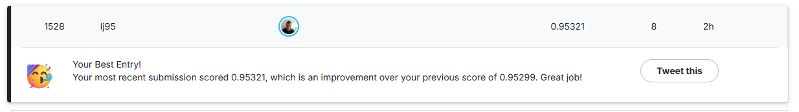

# Predicting Heart Disease
## Playground Series - Season 6 Episode 2
NB: This dataset is not representable to predict actual heart diseases, rather it is an educational dataset. <br/><br/>
This NoteBook is me refreshing my Machine Learning skills in general while using TensorFlow. <br/>  I did want to use a 'Decision Tree'-esque ML model to use for predicting cases, and thus I had to search for a fitting dataset. <br/> Fortunately, there was an ongoing Kaggle competition [Predicting Heart Disease](https://www.kaggle.com/competitions/playground-series-s6e2) that fitted this situation.

#### Scope
The goal in this project is to create a NoteBook that outputs a ML model/submission file that has a >95% accuracy on the final test set. <br/> 
This seems feasible by checking the [Leaderboard scores](https://www.kaggle.com/competitions/playground-series-s6e2/leaderboard) of this competition. <br/><br/>

Furtermore, in this Notebook I have added some personal touches or developing goals to challenge myself a little bit during this project.

#### Personal touches
- Create a class that represents a Machine Learning model.
- The class has multiple functions; train, predict, evaluate, and submit.
- The class can handle the following tf ML models: ```RandomForestLearner``` and ```GradientBoostedTreesLearner```
- The class can handle the presence/absence of hyperparameters.
<br/><br/>
- Create a dictionary that contains different tf ML model configurations for the class.
- Create a function that trains, predicts and evaluates all the input tf ML models configurations at once.
- Create a function that evaluates the best configurations for each ML model.
- Create a function that predicts the test set with the best configuration ML model and creates a submission.csv
<br/><br/>
- Running all cells at once produces the submission.csv of the best evaluated model.


**Not in scope** <br/>
Trying to get the best model possible by using all possible hyperparamater configurations and running the Notebook. <br/>
Rather it _should_ be possible in this Notebook to do so by simply adding the hyperparameters in a variable and running this notebook. 

### Results
Mission succeeded. <br/>
Score on the final test set: ```0.95321``` . <br/><br/>
<br/><br/>
### Ease of use
The way this notebook is set up allows for training, predicting, and evaluating of all the hyperparameters possible for the respective tf ML models ```RandomForestLearner``` and ```GradientBoostedTreesLearner``` in one run.  <br/>
To do that, simply add the hyperparameters as part of the parameter variable to DICT_ML_MODELS or keep the ones that are already present. <br/> <br/>
I think the chance to be reasonably high for this exact Notebook with the addition of adding some extra hyperparameter configuration to the 'parameter' variable will yield a higher accuracy than the one I have produced.

#### Note
The way that this machine learning model works is stochastic, and thus results in accuracy on your local machine will most likely vary. (just a little bit though)

# Introduction
The Notebook is pretty self explanatory, and contains information in the markdowns cells and comments.<br/><br/>
This notebook contains by default two ```TensorFlow (tf)```  Machine Learning models that are trained to predict Heart Disease presence in subjects. <br/> Running all cells at once should

The Kaggle dataset contains data that can be trained for the prediction of target column 'Heart Disease'. <br/>
The following steps are taken: 
1. Data exploration
2. Feature engineering
3. Creating models
4. Training models
5. Evaluating models
6. Submitting models


## Get started
### Clone repo (recommended)
```bash 
    cd /path/to/your/directory/
    git clone https://github.com/LesterJones95/Predicting-Heart-Disease.git
```

### Get and save kaggle API token
In Kaggle: ```Profile > Settings > Generate New Token```  <br/>
In Windows add the file: C:\Users\<USER>\.kaggle.json
```json
    {
    "username": "<USERNAME>",
    "key": "<API_KEY>"
    }
``` 

### Download dataset from Kaggle to your local machine
On local machine: 
```bash (run as Administor)
    # (In git-bash) You will need to "Run as Administrator" to install kaggle
    pip install kaggle
```
```bash
    # Download the dataset (5.15GB)
    export KAGGLE_API_TOKEN=<TOKEN>
    mkdir -p data && cd data
    kaggle competitions download -c playground-series-s6e2

    # Extract the files and remove .zip
    unzip playground-series-s6e2.zip && rm -rf playground-series-s6e2.zip
    ls -Al
```


# Run locally on your local machine 
## Running the container 
#### Run and build container with docker-compose (recommended)
```bash
    # from root where docker-compose file is:

    PROFILE=local-default #local-kaggle-datasets 
    docker compose --profile ${PROFILE} build
    docker compose --profile ${PROFILE} up

    # if port 8888 is busy
    EXTERNAL_PORT=9999 docker compose --profile ${PROFILE} up 
```

### Test Locally
After running the docker compose up, logs will be generated, somewhere a logline will look like: ```http(s)://localhost:8888```. <br/>
Follow that link, and you will find your notebook environment there. <br/> 
Note: if you follow the 'Secure notebook' steps below: your browser will probably give a warning that it does not "trust" your self-signed certificate if you configured SSL, that is not a problem because **you** trust it (hopefully). So proceed to the webpage.<br/>
Run the code and confirm that a (new) 'submission_Best_model.csv' file is created in the root of the directory.

## Secure notebook [optional]
#### Insecure connection to Jupyter Notebook
Although _I_ run this notebook (on a cpu) on a localhost at home  and therefore not exposed to the public internet and therefore malicious actors are unlikely to access this notebook, I like to copy/paste this secure setup. <br/>

#### Secure connection to Jupyter Notebook
However, it is good to follow through. <br/>
Hashing your password means that a hash of your password is stored. However without SSL certificates your password is still readable during a man in the middle attack because it is send with HTTP to the server. <br/> 
Using a password anyways is still easier than copying the authentication token that is generated by Jupyter each time the docker container starts. <br/>
Securing traffic with certificates means that your data (password or authentication token) is send encrypted over the network. 

### Create hashed password [optional]
Optionally you can create your own password for your Jupyter notebook by following the steps below: <br/>
If you choose not to, than a random security token will be generated each time you start the docker container.

```bash
    # in root folder
    PASSWORD=mypassword #change this password
    SALT=$(openssl rand -hex 12)

    # Create salted password and hash it
    SALTED="${PASSWORD}${SALT}"
    HASH=$(echo -n "$SALTED" | openssl dgst -sha1 -binary | xxd -p -c 256)

    # Format as Jupyter expects: sha1:salt:hash
    echo "JUPYTER_PASSWORD_HASH="sha1:${SALT}:${HASH}"" > ./jupyter-config/.env
```
### Creating SSL certificates [optional] (recommended)
With certificates you send data encrypted over the internet (HTTPS) and not in plain text (HTTP). <br/>
Adding self-signed certificates to your Jupyter Notebook instance ensures that your authentication password or token is encrypted before sending it over the internet. <br/>
Since these certificates are self signed your browser will not recognize them and still give a warning that your data might not be safe. <br/> 
You know though that you can trust the server and it's certificate and continue to the webpage. <br/>
**Important** the ```jupyter-config/certs/``` directory needs to exist for the build to run, but it can stay empty.
```bash
    # in root folder
    JUPYTER_DIR="./jupyter-config/certs"
    CERT_FILE="${JUPYTER_DIR}/jupyter_cert.pem"
    KEY_FILE="${JUPYTER_DIR}/jupyter_key.key"

    mkdir -p ${JUPYTER_DIR}
    openssl req -x509 -nodes -days 365 -newkey rsa:2048 -keyout "${KEY_FILE}" -out "${CERT_FILE}" -subj "//C=NL/ST=State/L=City/O=Organization/CN=localhost"
```

